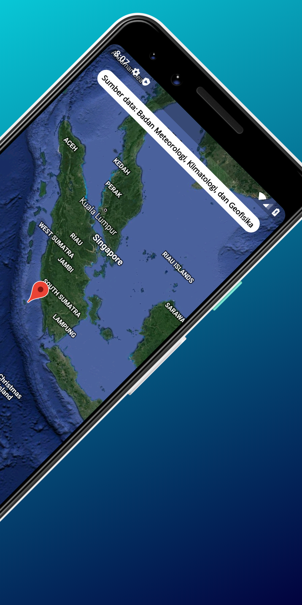
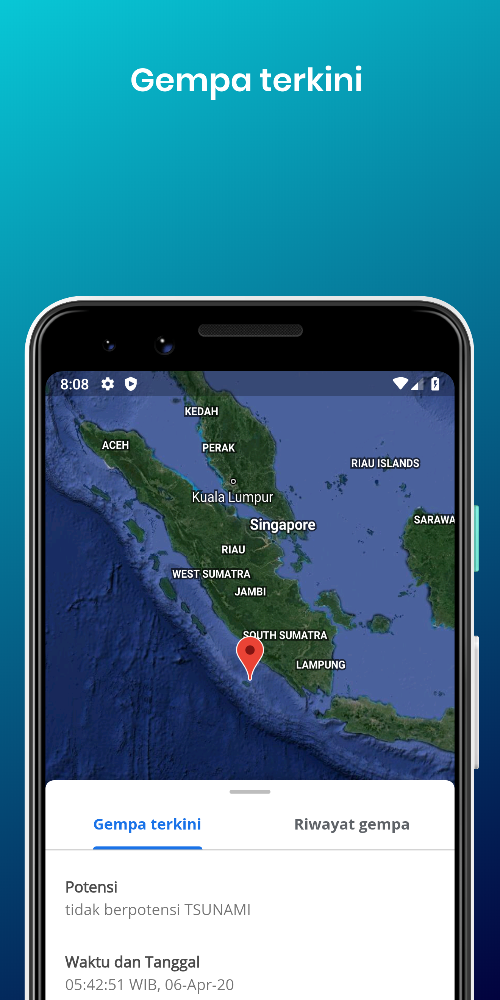
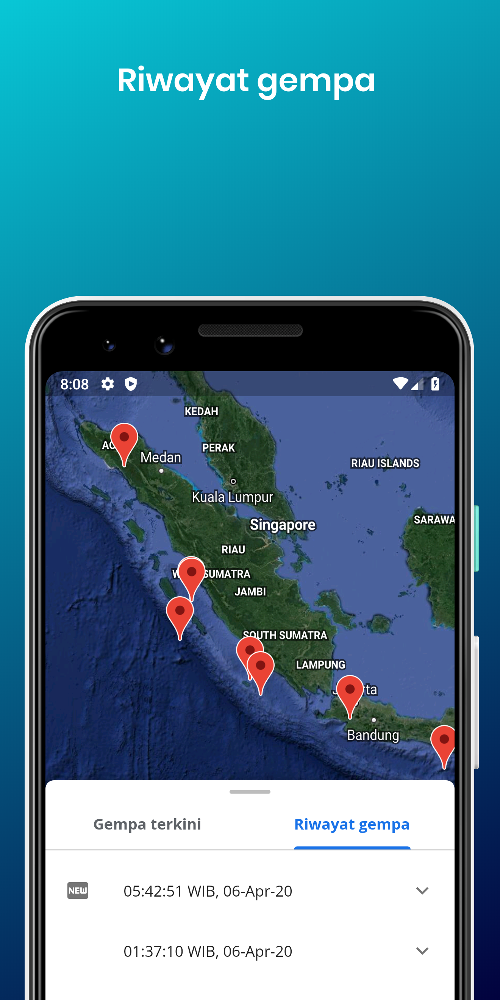
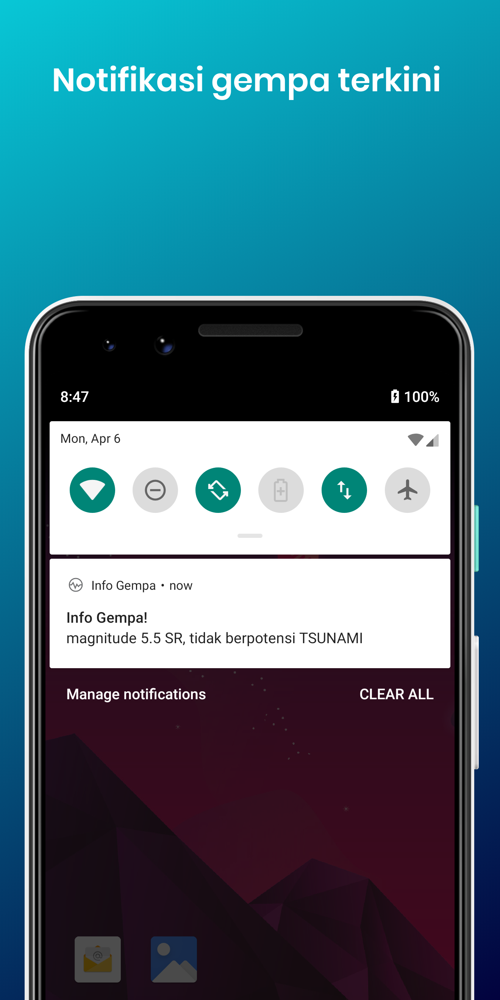

# Info Gempa

Informasi gempa terkini berdasarkan data Badan Meteorologi, Klimatologi, dan Geofisika

## TODO

- [x] Menampilkan info gempa bumi terkini
- [x] Menampilkan riwayat gempa bumi
- [x] Menampilkan notifikasi gempa bumi terkini

## Screenshot

  
   
  
   
   

